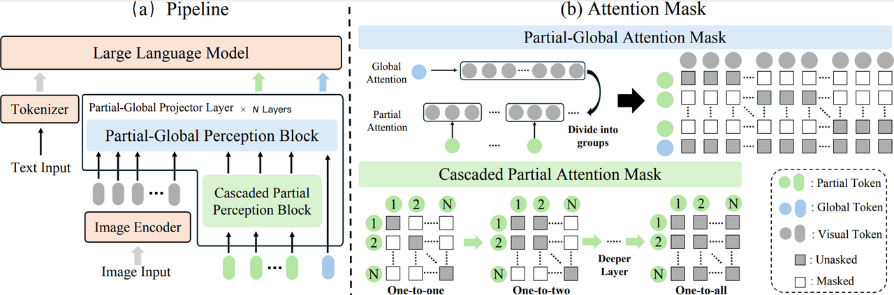

# ParGo: Bridging Vision-Language with Partial and Global Views
Official PyTorch Implementation of ParGo: Bridging Vision-Language with Partial and Global Views. (AAAI 2025)

[Paper](https://arxiv.org/abs/2408.12928), [Model](https://drive.google.com/file/d/1QdAF3Vv_oZjsfdpdyPezlMLUJ8IIFEiC/view?usp=drive_link)


## Setup
```
cd ParGo
conda create -n ParGo_env python=3.10 -y
conda activate ParGo_env
pip install torch==2.0.1+cu118 torchvision==0.15.2+cu118 torchaudio==2.0.2 --index-url https://download.pytorch.org/whl/cu118
pip install -r ./requirements.txt
```
## Download Models
The LLM(internlm2-7b) and vision_encoder(eva-clip-l-14-336) need to be downloaded in advance. 
## Evaluation
### MME Benchmark
#### Data
You can place the benchmark data in the benchmark directory. Data structure:
```
├── benchmarks
│   ├── MMEBenmark
│       └── images
│       └── Data_json
```
Json file in Data_json contains the image_name, question, answer, e.g., 
```
10002.jpg	Does this artwork exist in the form of painting? 	Yes
```

#### Evaluation 
Step 1: Generate the response:
```
python3 eval/eval_mme_finetuning.py --config ./configs/MMEBench_interLM2-7B.json
```
Step 2: Calculate the score:
```
python3 eval/calculation_mme.py --results_dir ./output/internlm2-MME
```

For other benchmarks, please follow their official instructions to construct the files; the overall pipeline is the same as evaluating in the MME benchmark.


## Acknowledgement
This project is developed based on [MiniGPT](https://github.com/Vision-CAIR/MiniGPT-4/tree/main?tab=readme-ov-file) and [BLIP2](https://huggingface.co/docs/transformers/main/model_doc/blip-2). Very sincere thanks to the contributors to these excellent codebases. 

If you find our code helpful to your research, please consider citing us with this BibTeX:
```
@misc{wang2024pargobridgingvisionlanguagepartial,
      title={ParGo: Bridging Vision-Language with Partial and Global Views}, 
      author={An-Lan Wang and Bin Shan and Wei Shi and Kun-Yu Lin and Xiang Fei and Guozhi Tang and Lei Liao and Jingqun Tang and Can Huang and Wei-Shi Zheng},
      year={2024},
      eprint={2408.12928},
      archivePrefix={arXiv},
      primaryClass={cs.CV},
      url={https://arxiv.org/abs/2408.12928}, 
}
```

## License
The source code and pretrained weights are licensed under [BSD-3-Clause](https://spdx.org/licenses/BSD-3-Clause.html)

